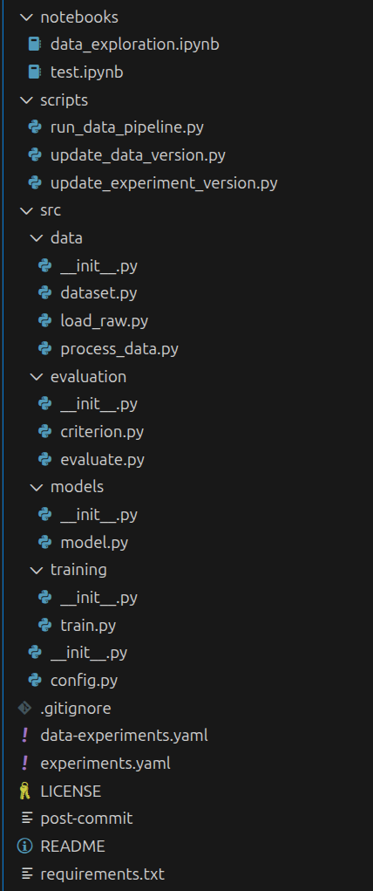

# JAX-ML-Template

## What is This Repository?

JAX is a (relatively) new machine learning technology that aims to be the best of both Tensorflow and PyTorch. Released 5 years ago, this has both the speed of Tensorflow and the flexibility of PyTorch builtin without complicated workarounds. Although it is currently in its early stages of development, many tools have developed around it, including machine learning libraries such as Flax, Optax, Orbax, etc. With Google behind most of these tools, they are likely to stay for a while. In this repository, I present my template for managing such a project and getting started quickly. This repository uses Flax and not Equinox because of Flax's Google backing and JAX-like functional nature.

## How do You Get Started?

The repository probably looks something like this for you right now:

Well, the first thing you want to do is create a virtual environment by running `python -m venv .venv` so you can separate your dependencies. This project was built using Python 3.12.3. If you look at the requirements.txt, you'll probably see A LOT of libraries, but most of these are just dependencies of the actually used libraries. This is a sample requirements.txt. What you actually need to install is the following:

`jax flax optax orbax grain tensorflow-cpu tqdm tensorboard scikit-learn numpy polars`

Make sure to install the accelerator version of jax if you can but if you have a CUDA-13 device you would like to use it with, you can just install directly from the requirements.txt

Now that you have your virtual environment setup, you can actually start understanding the directory layout.

## The Directory Layout

- `data-experiments.yaml`: A yaml file to version your data and the code used to retrieve them. Contains essentials like a git commit id to go back to.
- `experiments.yaml`: A yaml file to version your different models and anything else you want to be able to go back to. Contains essentials like a git commit id for easy navigation.
- `LICENSE`: The license for this repository
- `post-commit`: This is an experimental git hook to automtically run your data/model pipeline as soon as you commit a change to certain files. Use with caution by moving into .git/hooks
- `README`: The file you are reading right now
- `requirements.txt`: A simple python requirements.txt that you might have for such a project
- `src/`: Contains (most) of your code
    - `data/`: Contains data related utilities
        - `__init__.py`: A standard Python file for declaring it as a module
        - `dataset.py`: This is where you define your data handling utilities to use with Grain for feeding data to your model. Most importantly, it contains a data source class to customize data loading behavior.
        - `load_raw.py`: A Python script that you may use to write code that loads raw data from somewhere
        - `process_data.py`: A Python script that you should use to preprocess your data before feeding it into your model dataloading system.
    - `evaluation/`: Contains model evaluation utilities
        - `__init__.py`: A standard Python file for declaring it as a module
        - `criterion.py`: A Python for declaring utility criterion that may be used to evaluate or train your model
        - `evaluate.py`: A Python script for testing your model. This file should not require significant changes (other than adding stuff) unless you change the training code
    - `models/`: Contains all the Python scripts necessary for declaring your models
        - `__init__.py`: A standard Python file for declaring it as a module
        - `model.py`: This is where you should define your main model that you want to train.
    - `training/`: This package contains your model training functions and utilities:
        - `__init__.py`: A standard Python file for declaring it as a module
        - `train.py`: This is where most of the model training code is with a prebuilt training loop that is heavily optimized. The `if __name__ == "__main__"` code contains a sample that doesn't work but you can use it to place your model specific code. Or you can use another script if you do not need to adjust the training loop (unlikely).
    - `__init__.py`: A standard Python file for declaring it as a module
    - `config.py`: This Python file contains all the configuration your model, your data, and everything else will use.

## Running Code

You can run your code using `python -m src.package.module` or use one of the prebuilt scripts in `scripts/`. The `scripts/` require the `yaml` package which can also be installed through pip.

You can also explore and experiment with different things in the `notebooks/` folder for Jupyter notebooks. But you'll need to isntall the `ipykernel` package for that.